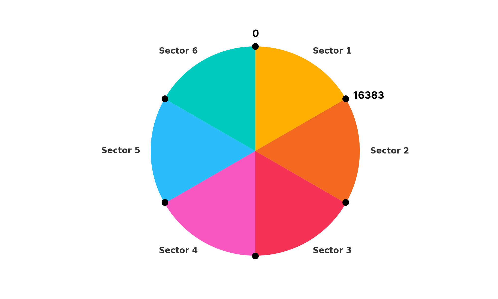

## What is sector homing?

The image represents a 6:1 gear reduction with a Spectral micro BLDC driver. Each sector represents one full rotation of the BLDC motor. For the motor encoder, each sector begins at 0 encoder ticks and ends at 16,383 encoder ticks. Sector homing allows you to record the initial position of the encoder and map it to a specific value for your joint. With this setup, if your robot joint boots in the correct sector, it will know its true position. 

Note: This is a simplified explanation. The algorithm is a bit more complex and includes some smart features. To learn more, check the source code. 

As the gear reduction ratio increases, this method becomes less effective. However, it works well for ratios up to 15:1.

Examples can be found [here!](https://github.com/PCrnjak/Source-Robotics-Toolbox/tree/main/Examples)
